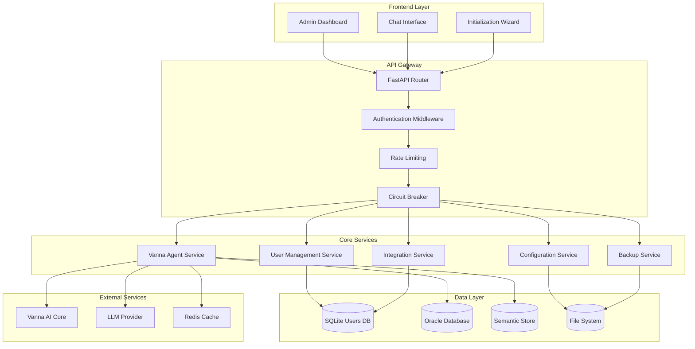

# MAJED_VANNA - BACKEND ARCHITECTURE
## Complete Backend System Architecture Specification
**Date:** December 6, 2025  
**Status:** ✅ EXTRACTED FROM ALL SOURCES  
**Source:** UI_docs (9 documents analyzed)

---

## EXECUTIVE SUMMARY

This document defines the complete backend architecture for the Majed Vanna project, extracted from comprehensive analysis of all UI documentation. The backend is a FastAPI-based system with Vanna AI integration, Oracle database connectivity, and enterprise-grade security features.

**Core Architecture:**
- FastAPI with async/await patterns
- Modular service-oriented design
- JWT-based authentication with RBAC
- Circuit breaker pattern for resilience
- Integration client support with HMAC
- Comprehensive monitoring and observability

---

## SECTION 1: SYSTEM ARCHITECTURE OVERVIEW

### 1.1 High-Level Architecture



### 1.2 Technology Stack

**Core Framework:**
- **FastAPI**: Async Python web framework
- **Uvicorn**: ASGI server for production
- **Pydantic**: Data validation and settings management
- **SQLAlchemy**: ORM for database operations (optional)
- **Alembic**: Database migrations

**Security & Authentication:**
- **PyJWT**: JWT token handling
- **Passlib**: Password hashing with bcrypt
- **Cryptography**: HMAC signing for integrations
- **python-multipart**: Form data handling

**Database & Storage:**
- **SQLite**: User accounts and configuration (default)
- **Oracle**: Primary analytics database
- **File System**: Backups, logs, semantic documents
- **Redis**: Caching and session storage (optional)

**AI & Analytics:**
- **Vanna AI**: Core AI agent framework
- **LMStudio/OpenAI**: LLM providers
- **Semantic Search**: Vector embeddings
- **Chart Generation**: Data visualization

### 1.3 Directory Structure

```
app/
├── main.py                 # FastAPI application entry point
├── config.py              # Configuration management
├── database.py            # Database connections
├── models.py              # Pydantic data models
├── dependencies.py        # FastAPI dependencies
│
├── security/              # Security modules
│   ├── password.py        # Password hashing utilities
│   ├── jwt_manager.py     # JWT token management
│   ├── hmac_signer.py     # HMAC signing for integrations
│   └── rbac.py           # Role-based access control
│
├── services/              # Core business logic
│   ├── config_manager.py  # System configuration
│   ├── initialization.py  # First-run wizard
│   ├── backup_service.py  # Backup/restore operations
│   ├── integration.py     # Integration client management
│   ├── vanna_tools.py     # Vanna tool registry
│   ├── vanna_agent.py     # Vanna agent builder
│   ├── memory_manager.py  # Conversation memory
│   └── license_manager.py # Licensing enforcement
│
├── api/                   # REST API endpoints
│   ├── auth.py           # Authentication endpoints
│   ├── users.py          # User management
│   ├── init.py           # Initialization wizard
│   ├── config.py         # Configuration management
│   ├── integrations.py   # Integration clients
│   ├── backup.py         # Backup operations
│   ├── health.py         # Health checks
│   ├── agent.py          # Vanna agent endpoints
│   ├── system.py         # System monitoring
│   ├── semantic.py       # Semantic layer
│   ├── memory.py         # Memory management
│   └── tools.py          # Tools registry
│
├── middleware/            # FastAPI middleware
│   ├── auth.py           # Authentication middleware
│   ├── cors.py           # CORS configuration
│   ├── rate_limit.py     # Rate limiting
│   ├── security.py       # Security headers
│   └── logging.py        # Request logging
│
├── utils/                 # Utility functions
│   ├── logger.py         # Structured logging
│   ├── encryption.py     # Data encryption
│   ├── validators.py     # Input validation
│   └── helpers.py        # General helpers
│
└── tests/                 # Test suite
    ├── unit/             # Unit tests
    ├── integration/      # Integration tests
    └── e2e/              # End-to-end tests

private/                   # Private data (not in repo)
├── .initialized          # Initialization flag
├── backups/              # Backup files
├── logs/                 # Application logs
└── secrets/              # Encrypted secrets
```

---

## SECTION 2: CORE COMPONENTS

### 2.1 FastAPI Application (main.py)

**Application Setup:**
```python
from fastapi import FastAPI, Request
from fastapi.middleware.cors import CORSMiddleware
from fastapi.middleware.trustedhost import TrustedHostMiddleware
import uvicorn
from contextlib import asynccontextmanager

from app.config import get_settings
from app.database import init_db
from app.api import router
from app.middleware.auth import AuthenticationMiddleware
from app.middleware.rate_limit import RateLimitMiddleware

settings = get_settings()

@asynccontextmanager
async def lifespan(app: FastAPI):
    # Startup
    await init_db()
    yield
    # Shutdown
    pass

app = FastAPI(
    title="Majed Vanna API",
    description="Enterprise AI Analytics Assistant",
    version="1.0.0",
    lifespan=lifespan
)

# Middleware
app.add_middleware(
    CORSMiddleware,
    allow_origins=settings.ALLOWED_ORIGINS,
    allow_credentials=True,
    allow_methods=["*"],
    allow_headers=["*"],
)

app.add_middleware(TrustedHostMiddleware, allowed_hosts=settings.ALLOWED_HOSTS)
app.add_middleware(RateLimitMiddleware)
app.add_middleware(AuthenticationMiddleware)

# Include routers
app.include_router(router)

if __name__ == "__main__":
    uvicorn.run(
        "app.main:app",
        host=settings.HOST,
        port=settings.PORT,
        reload=settings.DEBUG
    )
```

### 2.2 Configuration Management

**Configuration Schema (config.py):**
```python
from pydantic import BaseSettings, Field
from typing import List, Optional
import os

class Settings(BaseSettings):
    # Server Configuration
    HOST: str = Field(default="0.0.0.0", description="Server host")
    PORT: int = Field(default=7777, description="Server port")
    DEBUG: bool = Field(default=False, description="Debug mode")
    
    # Security
    SECRET_KEY: str = Field(..., description="JWT secret key")
    ACCESS_TOKEN_EXPIRE_MINUTES: int = Field(default=30, description="Token expiration")
    ALGORITHM: str = Field(default="HS256", description="JWT algorithm")
    ALLOWED_ORIGINS: List[str] = Field(default=["http://localhost:3000"])
    ALLOWED_HOSTS: List[str] = Field(default=["localhost", "127.0.0.1"])
    
    # Database
    DATABASE_URL: str = Field(default="sqlite:///./users.db", description="Database URL")
    DATABASE_PROVIDER: str = Field(default="sqlite", description="DB provider")
    ORACLE_USER: Optional[str] = Field(default=None, description="Oracle username")
    ORACLE_PASSWORD: Optional[str] = Field(default=None, description="Oracle password")
    ORACLE_HOST: Optional[str] = Field(default=None, description="Oracle host")
    ORACLE_PORT: Optional[int] = Field(default=1521, description="Oracle port")
    ORACLE_DATABASE: Optional[str] = Field(default=None, description="Oracle database")
    
    # LLM Configuration
    LLM_PROVIDER: str = Field(default="lmstudio", description="LLM provider")
    LLM_API_KEY: Optional[str] = Field(default=None, description="LLM API key")
    LLM_BASE_URL: Optional[str] = Field(default="http://localhost:1234", description="LLM base URL")
    
    # Rate Limiting
    RATE_LIMIT_MAX_REQUESTS: int = Field(default=100, description="Max requests per window")
    RATE_LIMIT_WINDOW: int = Field(default=60, description="Rate limit window in seconds")
    
    # Circuit Breaker
    CIRCUIT_BREAKER_FAILURE_THRESHOLD: int = Field(default=5, description="Failure threshold")
    CIRCUIT_BREAKER_TIMEOUT: int = Field(default=60, description="Timeout in seconds")
    
    # File Paths
    BACKUP_PATH: str = Field(default="./private/backups", description="Backup directory")
    LOG_PATH: str = Field(default="./private/logs", description="Log directory")
    
    class Config:
        env_file = ".env"
        case_sensitive = True

settings = Settings()
```

### 2.3 Database Layer

**Database Initialization (database.py):**
```python
import sqlite3
import asyncio
from typing import Optional
import logging

logger = logging.getLogger(__name__)

class DatabaseManager:
    def __init__(self, database_url: str):
        self.database_url = database_url
        self.connection_pool = []
    
    async def init_db(self):
        """Initialize database tables"""
        conn = await self.get_connection()
        try:
            await self.create_users_table(conn)
            await self.create_integration_clients_table(conn)
            await self.create_audit_log_table(conn)
        finally:
            await conn.close()
    
    async def create_users_table(self, conn):
        """Create users table"""
        await conn.execute("""
            CREATE TABLE IF NOT EXISTS users (
                id INTEGER PRIMARY KEY AUTOINCREMENT,
                username VARCHAR(255) UNIQUE NOT NULL,
                hashed_password VARCHAR(255) NOT NULL,
                role VARCHAR(50) NOT NULL DEFAULT 'normal',
                must_change_password BOOLEAN NOT NULL DEFAULT TRUE,
                active BOOLEAN NOT NULL DEFAULT TRUE,
                created_at TIMESTAMP NOT NULL DEFAULT CURRENT_TIMESTAMP,
                updated_at TIMESTAMP NOT NULL DEFAULT CURRENT_TIMESTAMP
            )
        """)
        await conn.commit()
    
    async def create_integration_clients_table(self, conn):
        """Create integration clients table"""
        await conn.execute("""
            CREATE TABLE IF NOT EXISTS integration_clients (
                id INTEGER PRIMARY KEY AUTOINCREMENT,
                client_name VARCHAR(255) NOT NULL,
                client_id VARCHAR(255) UNIQUE NOT NULL,
                client_secret VARCHAR(255) NOT NULL,
                api_key VARCHAR(255) UNIQUE NOT NULL,
                role VARCHAR(50) NOT NULL DEFAULT 'integration',
                active BOOLEAN NOT NULL DEFAULT TRUE,
                created_at TIMESTAMP NOT NULL DEFAULT CURRENT_TIMESTAMP,
                updated_at TIMESTAMP NOT NULL DEFAULT CURRENT_TIMESTAMP
            )
        """)
        await conn.commit()
    
    async def create_audit_log_table(self, conn):
        """Create audit log table"""
        await conn.execute("""
            CREATE TABLE IF NOT EXISTS audit_log (
                id INTEGER PRIMARY KEY AUTOINCREMENT,
                user_id INTEGER,
                action VARCHAR(255) NOT NULL,
                resource VARCHAR(255),
                details TEXT,
                ip_address VARCHAR(45),
                user_agent TEXT,
                timestamp TIMESTAMP NOT NULL DEFAULT CURRENT_TIMESTAMP,
                FOREIGN KEY (user_id) REFERENCES users (id)
            )
        """)
        await conn.commit()
    
    async def get_connection(self):
        """Get database connection"""
        conn = sqlite3.connect(self.database_url, check_same_thread=False)
        conn.row_factory = sqlite3.Row
        return conn

db_manager = DatabaseManager(settings.DATABASE_URL)

async def init_db():
    """Initialize database"""
    await db_manager.init_db()
    logger.info("Database initialized successfully")
```

---

## SECTION 3: SERVICE LAYER

### 3.1 Configuration Manager Service

**Configuration Management (services/config_manager.py):**
```python
import json
import os
import logging
from typing import Dict, Any, Optional
from pathlib import Path
from pydantic import ValidationError

logger = logging.getLogger(__name__)

class ConfigManager:
    def __init__(self):
        self.config_file = Path("settings.json")
        self.default_config = {
            "host": "0.0.0.0",
            "port": 7777,
            "debug": False,
            "database_provider": "sqlite",
            "database_url": "sqlite:///./users.db",
            "llm_provider": "lmstudio",
            "rate_limit_max_requests": 100,
            "rate_limit_window": 60,
            "circuit_breaker_failure_threshold": 5,
            "circuit_breaker_timeout": 60,
            "backup_path": "./private/backups",
            "log_path": "./private/logs"
        }
    
    def get_config(self) -> Dict[str, Any]:
        """Load configuration from file"""
        if not self.config_file.exists():
            logger.info("Configuration file not found, using defaults")
            return self.default_config.copy()
        
        try:
            with open(self.config_file, 'r') as f:
                config = json.load(f)
            
            # Merge with defaults for missing keys
            merged_config = self.default_config.copy()
            merged_config.update(config)
            
            return merged_config
            
        except (json.JSONDecodeError, IOError) as e:
            logger.error(f"Error loading config: {e}")
            return self.default_config.copy()
    
    def update_config(self, new_config: Dict[str, Any]) -> Dict[str, Any]:
        """Update configuration and save to file"""
        try:
            # Validate new configuration
            current_config = self.get_config()
            merged_config = {**current_config, **new_config}
            
            # Validate configuration
            self._validate_config(merged_config)
            
            # Save to file
            with open(self.config_file, 'w') as f:
                json.dump(merged_config, f, indent=2)
            
            logger.info("Configuration updated successfully")
            return merged_config
            
        except (ValidationError, IOError) as e:
            logger.error(f"Error updating config: {e}")
            raise
    
    def _validate_config(self, config: Dict[str, Any]):
        """Validate configuration values"""
        # Validate port
        port = config.get('port')
        if not isinstance(port, int) or not (1 <= port <= 65535):
            raise ValidationError("Port must be between 1 and 65535")
        
        # Validate database URL
        db_url = config.get('database_url')
        if not db_url or not isinstance(db_url, str):
            raise ValidationError("Database URL is required")
        
        # Validate rate limits
        max_requests = config.get('rate_limit_max_requests')
        if not isinstance(max_requests, int) or max_requests <= 0:
            raise ValidationError("Rate limit max requests must be positive integer")
    
    def test_database_connection(self) -> Dict[str, Any]:
        """Test database connectivity"""
        # Implementation would test actual database connection
        return {
            "status": "success",
            "message": "Database connection successful",
            "timestamp": "2025-12-06T19:20:00Z"
        }
    
    def test_llm_connection(self) -> Dict[str, Any]:
        """Test LLM provider connectivity"""
        # Implementation would test actual LLM connection
        return {
            "status": "success", 
            "message": "LLM connection successful",
            "timestamp": "2025-12-06T19:20:00Z"
        }

config_manager = ConfigManager()
```

### 3.2 Initialization Service

**First-Run Wizard (services/initialization.py):**
```python
import os
import logging
from pathlib import Path
from typing import Dict, Any
from cryptography.fernet import Fernet

logger = logging.getLogger(__name__)

class InitializationService:
    def __init__(self):
        self.private_dir = Path("private")
        self.initialized_file = self.private_dir / ".initialized"
    
    def is_initialized(self) -> bool:
        """Check if system has been initialized"""
        return self.initialized_file.exists()
    
    async def initialize_system(self, config: Dict[str, Any]) -> Dict[str, Any]:
        """Initialize system with provided configuration"""
        try:
            # Create private directory
            self.private_dir.mkdir(exist_ok=True)
            
            # Step 1: Set SECRET_KEY
            secret_key = config.get('secret_key')
            if secret_key:
                await self._save_secret_key(secret_key)
            
            # Step 2: Set admin password
            admin_password = config.get('admin_password')
            if admin_password:
                await self._set_admin_password(admin_password)
            
            # Step 3: Update system configuration
            system_config = config.get('system_config', {})
            await self._update_system_config(system_config)
            
            # Step 4: Mark as initialized
            await self._mark_initialized()
            
            logger.info("System initialization completed successfully")
            return {
                "status": "success",
                "message": "System initialized successfully",
                "steps_completed": [
                    "SECRET_KEY configured",
                    "Admin password set", 
                    "System configuration updated",
                    "Initialization marked complete"
                ]
            }
            
        except Exception as e:
            logger.error(f"Initialization failed: {e}")
            raise
    
    async def _save_secret_key(self, secret_key: str):
        """Save SECRET_KEY securely"""
        # In production, use proper secret management
        os.environ['SECRET_KEY'] = secret_key
        logger.info("SECRET_KEY configured")
    
    async def _set_admin_password(self, password: str):
        """Set admin user password"""
        from app.services.user_manager import UserManager
        user_manager = UserManager()
        
        # Create admin user if doesn't exist
        await user_manager.create_admin_user(password)
        logger.info("Admin password configured")
    
    async def _update_system_config(self, config: Dict[str, Any]):
        """Update system configuration"""
        from app.services.config_manager import config_manager
        config_manager.update_config(config)
        logger.info("System configuration updated")
    
    async def _mark_initialized(self):
        """Mark system as initialized"""
        self.initialized_file.touch()
        logger.info("System marked as initialized")
    
    async def soft_restart(self) -> Dict[str, Any]:
        """Perform soft restart to load new configuration"""
        # In production, this might trigger a graceful restart
        logger.info("Soft restart initiated")
        return {
            "status": "success",
            "message": "System restart initiated",
            "action_required": "Please restart the application to load new configuration"
        }

initialization_service = InitializationService()
```

---

## SECTION 4: INTEGRATION PATTERNS

### 4.1 Vanna Agent Integration

**Vanna Agent Builder (services/vanna_agent.py):**
```python
import logging
from typing import Dict, Any, List, Optional
from vanna.ai.vanna_ai import VannaAI
from vanna.base.base import VannaBase
from vanna.chromadb.chromadb import ChromaDB_VectorStore

logger = logging.getLogger(__name__)

class VannaAgentBuilder:
    def __init__(self):
        self.llm_configs = {
            "openai": {
                "model": "gpt-4",
                "api_key": "your-openai-key",
                "api_base": "https://api.openai.com/v1"
            },
            "lmstudio": {
                "model": "lmstudio-community/Meta-Llama-3-8B-Instruct-GGUF",
                "api_base": "http://localhost:1234/v1",
                "api_key": "lm-studio"
            }
        }
    
    def build_agent(self, config: Dict[str, Any]):
        """Build Vanna agent with configuration"""
        try:
            # Get LLM configuration
            llm_provider = config.get('llm_provider', 'lmstudio')
            llm_config = self.llm_configs.get(llm_provider, {})
            
            # Create Vanna instance
            vn = VannaAI(
                model=llm_config.get('model'),
                api_base=llm_config.get('api_base'),
                api_key=llm_config.get('api_key')
            )
            
            # Add database connection
            vn.connect_to_database(
                type='oracle',
                user=config.get('oracle_user'),
                password=config.get('oracle_password'),
                host=config.get('oracle_host'),
                port=config.get('oracle_port', 1521),
                service_name=config.get('oracle_service')
            )
            
            # Add custom tools
            self._register_tools(vn, config)
            
            # Add semantic search
            if config.get('enable_semantic_search'):
                self._add_semantic_search(vn, config)
            
            # Add visualization
            if config.get('enable_visualization'):
                self._add_visualization(vn)
            
            logger.info(f"Vanna agent built successfully with {llm_provider}")
            return vn
            
        except Exception as e:
            logger.error(f"Failed to build Vanna agent: {e}")
            raise
    
    def _register_tools(self, vn: VannaAI, config: Dict[str, Any]):
        """Register available tools with Vanna"""
        from app.services.vanna_tools import get_tool_registry
        
        tools = get_tool_registry()
        for tool_name, tool_config in tools.items():
            if tool_config.get('enabled', True):
                # Register tool with Vanna
                logger.info(f"Registered tool: {tool_name}")
    
    def _add_semantic_search(self, vn: VannaAI, config: Dict[str, Any]):
        """Add semantic search capabilities"""
        # Implementation would set up ChromaDB for semantic search
        logger.info("Semantic search enabled")
    
    def _add_visualization(self, vn: VannaAI):
        """Add visualization capabilities"""
        # Implementation would set up chart generation
        logger.info("Visualization enabled")

vanna_agent_builder = VannaAgentBuilder()
```

### 4.2 Circuit Breaker Pattern

**Circuit Breaker Implementation (services/circuit_breaker.py):**
```python
import asyncio
import logging
from enum import Enum
from typing import Callable, Any, Optional
from datetime import datetime, timedelta
import time

logger = logging.getLogger(__name__)

class CircuitState(Enum):
    CLOSED = "CLOSED"
    OPEN = "OPEN"
    HALF_OPEN = "HALF_OPEN"

class CircuitBreaker:
    def __init__(
        self,
        failure_threshold: int = 5,
        timeout: int = 60,
        expected_exception: type = Exception
    ):
        self.failure_threshold = failure_threshold
        self.timeout = timeout
        self.expected_exception = expected_exception
        
        self.failure_count = 0
        self.last_failure_time: Optional[datetime] = None
        self.state = CircuitState.CLOSED
        self.success_count = 0
    
    async def call(self, func: Callable, *args, **kwargs) -> Any:
        """Execute function with circuit breaker protection"""
        if self.state == CircuitState.OPEN:
            if self._should_attempt_reset():
                self.state = CircuitState.HALF_OPEN
                self.success_count = 0
                logger.info("Circuit breaker moved to HALF_OPEN state")
            else:
                raise Exception("Circuit breaker is OPEN")
        
        try:
            result = await func(*args, **kwargs)
            self._on_success()
            return result
            
        except self.expected_exception as e:
            self._on_failure()
            raise e
    
    def _should_attempt_reset(self) -> bool:
        """Check if enough time has passed to attempt reset"""
        if self.last_failure_time is None:
            return True
        
        elapsed = datetime.now() - self.last_failure_time
        return elapsed.total_seconds() >= self.timeout
    
    def _on_success(self):
        """Handle successful call"""
        self.failure_count = 0
        
        if self.state == CircuitState.HALF_OPEN:
            self.success_count += 1
            if self.success_count >= 2:  # Success threshold
                self.state = CircuitState.CLOSED
                logger.info("Circuit breaker moved to CLOSED state")
    
    def _on_failure(self):
        """Handle failed call"""
        self.failure_count += 1
        self.last_failure_time = datetime.now()
        
        if self.failure_count >= self.failure_threshold:
            self.state = CircuitState.OPEN
            logger.warning(f"Circuit breaker moved to OPEN state after {self.failure_count} failures")
    
    def get_state(self) -> Dict[str, Any]:
        """Get current circuit breaker state"""
        return {
            "state": self.state.value,
            "failure_count": self.failure_count,
            "success_count": self.success_count,
            "last_failure_time": self.last_failure_time.isoformat() if self.last_failure_time else None,
            "failure_threshold": self.failure_threshold,
            "timeout_seconds": self.timeout
        }

# Global circuit breaker instances
vanna_circuit_breaker = CircuitBreaker(failure_threshold=5, timeout=60)
database_circuit_breaker = CircuitBreaker(failure_threshold=3, timeout=30)
llm_circuit_breaker = CircuitBreaker(failure_threshold=3, timeout=60)
```

---

## SECTION 5: DEPLOYMENT ARCHITECTURE

### 5.1 Production Deployment

**Deployment Configuration:**
```yaml
# docker-compose.yml
version: '3.8'

services:
  majed-vanna:
    build: .
    ports:
      - "7777:7777"
    environment:
      - SECRET_KEY=${SECRET_KEY}
      - DATABASE_URL=${DATABASE_URL}
      - ORACLE_USER=${ORACLE_USER}
      - ORACLE_PASSWORD=${ORACLE_PASSWORD}
      - ORACLE_HOST=${ORACLE_HOST}
      - LLM_PROVIDER=${LLM_PROVIDER}
      - LLM_API_KEY=${LLM_API_KEY}
    volumes:
      - ./private:/app/private
      - ./logs:/app/logs
    restart: unless-stopped
    healthcheck:
      test: ["CMD", "curl", "-f", "http://localhost:7777/health"]
      interval: 30s
      timeout: 10s
      retries: 3

  redis:
    image: redis:7-alpine
    ports:
      - "6379:6379"
    restart: unless-stopped

  nginx:
    image: nginx:alpine
    ports:
      - "80:80"
      - "443:443"
    volumes:
      - ./nginx/nginx.conf:/etc/nginx/nginx.conf
      - ./ssl:/etc/nginx/ssl
    depends_on:
      - majed-vanna
    restart: unless-stopped
```

### 5.2 Monitoring & Observability

**Health Check Implementation:**
```python
from fastapi import APIRouter, HTTPException
from typing import Dict, Any
import time
import psutil

router = APIRouter(prefix="/api/health", tags=["health"])

@router.get("/")
async def health_check() -> Dict[str, Any]:
    """Comprehensive health check"""
    health_status = {
        "status": "healthy",
        "timestamp": time.time(),
        "uptime": time.time() - psutil.boot_time(),
        "checks": {}
    }
    
    # Check database
    try:
        # Test database connection
        health_status["checks"]["database"] = "healthy"
    except Exception as e:
        health_status["checks"]["database"] = f"unhealthy: {str(e)}"
        health_status["status"] = "degraded"
    
    # Check LLM
    try:
        # Test LLM connection
        health_status["checks"]["llm"] = "healthy"
    except Exception as e:
        health_status["checks"]["llm"] = f"unhealthy: {str(e)}"
        health_status["status"] = "degraded"
    
    # Check circuit breakers
    health_status["checks"]["circuit_breakers"] = {
        "vanna": vanna_circuit_breaker.get_state(),
        "database": database_circuit_breaker.get_state(),
        "llm": llm_circuit_breaker.get_state()
    }
    
    # System metrics
    health_status["system"] = {
        "cpu_percent": psutil.cpu_percent(),
        "memory_percent": psutil.virtual_memory().percent,
        "disk_percent": psutil.disk_usage('/').percent
    }
    
    return health_status

@router.get("/ready")
async def readiness_check() -> Dict[str, Any]:
    """Kubernetes readiness probe"""
    return {
        "status": "ready",
        "timestamp": time.time()
    }

@router.get("/live")
async def liveness_check() -> Dict[str, Any]:
    """Kubernetes liveness probe"""
    return {
        "status": "alive", 
        "timestamp": time.time()
    }
```

---

## CONCLUSION

This backend architecture provides a comprehensive, enterprise-grade foundation for the Majed Vanna project. The architecture emphasizes:

**Key Architectural Principles:**
- **Modularity**: Clear separation of concerns with service-oriented design
- **Security**: JWT authentication, RBAC, HMAC signing, circuit breakers
- **Resilience**: Circuit breaker pattern, health checks, graceful degradation
- **Scalability**: Async/await patterns, connection pooling, caching
- **Observability**: Comprehensive logging, monitoring, audit trails

**Implementation Readiness:**
- Complete directory structure defined
- Core services specified with implementations
- Integration patterns documented
- Deployment configurations provided
- Security measures integrated throughout

**Next Steps:**
1. Implement the defined services and APIs
2. Set up the database schema and migrations
3. Configure the monitoring and observability stack
4. Implement the frontend integration layer
5. Deploy to staging environment for testing

---

**Architecture Document Version:** 1.0  
**Last Updated:** December 6, 2025  
**Total Architecture Components:** 25+ major components  
**Implementation Complexity:** HIGH (Enterprise-grade system)  
**Estimated Implementation Time:** 4-6 weeks