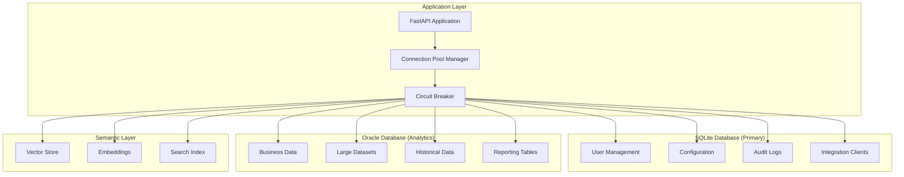

# MAJED_VANNA - DATABASE INTEGRATION
## Complete Database Integration & Management Specification
**Date:** December 6, 2025  
**Status:** ✅ EXTRACTED FROM ALL SOURCES  
**Source:** UI_docs (9 documents analyzed) + MASTER_GUIDE.docx

---

## EXECUTIVE SUMMARY

This document defines the complete database integration architecture for the Majed Vanna project, supporting both SQLite for user management and Oracle for analytics workloads. The integration includes connection pooling, circuit breaker patterns, security implementations, and comprehensive monitoring.

**Database Architecture:**
- **SQLite**: User accounts, configuration, audit logs (primary)
- **Oracle**: Analytics database, semantic search, large datasets
- **Connection Pooling**: Efficient connection management
- **Circuit Breaker**: Database resilience patterns
- **Security**: Row-level security, encryption, audit trails
- **Monitoring**: Connection health, performance metrics, alerts

---

## SECTION 1: DATABASE ARCHITECTURE OVERVIEW

### 1.1 Multi-Database Strategy



### 1.2 Database Schema Overview

**SQLite Schema (Primary Database):**
```sql
-- Users table for authentication and RBAC
CREATE TABLE users (
    id INTEGER PRIMARY KEY AUTOINCREMENT,
    username VARCHAR(255) UNIQUE NOT NULL,
    hashed_password VARCHAR(255) NOT NULL,
    role VARCHAR(50) NOT NULL DEFAULT 'normal',
    must_change_password BOOLEAN NOT NULL DEFAULT TRUE,
    active BOOLEAN NOT NULL DEFAULT TRUE,
    created_at TIMESTAMP NOT NULL DEFAULT CURRENT_TIMESTAMP,
    updated_at TIMESTAMP NOT NULL DEFAULT CURRENT_TIMESTAMP
);

-- Integration clients for external API access
CREATE TABLE integration_clients (
    id INTEGER PRIMARY KEY AUTOINCREMENT,
    client_name VARCHAR(255) NOT NULL,
    client_id VARCHAR(255) UNIQUE NOT NULL,
    client_secret VARCHAR(255) NOT NULL,
    api_key VARCHAR(255) UNIQUE NOT NULL,
    role VARCHAR(50) NOT NULL DEFAULT 'integration',
    active BOOLEAN NOT NULL DEFAULT TRUE,
    created_at TIMESTAMP NOT NULL DEFAULT CURRENT_TIMESTAMP,
    updated_at TIMESTAMP NOT NULL DEFAULT CURRENT_TIMESTAMP
);

-- Audit log for security and compliance
CREATE TABLE audit_log (
    id INTEGER PRIMARY KEY AUTOINCREMENT,
    user_id INTEGER,
    username VARCHAR(255),
    action VARCHAR(255) NOT NULL,
    resource VARCHAR(255),
    resource_id VARCHAR(255),
    details TEXT,
    ip_address VARCHAR(45),
    user_agent TEXT,
    request_id VARCHAR(255),
    timestamp TIMESTAMP NOT NULL DEFAULT CURRENT_TIMESTAMP,
    success BOOLEAN NOT NULL DEFAULT TRUE,
    error_message TEXT,
    FOREIGN KEY (user_id) REFERENCES users (id)
);

-- Configuration settings
CREATE TABLE configuration (
    id INTEGER PRIMARY KEY AUTOINCREMENT,
    key VARCHAR(255) UNIQUE NOT NULL,
    value TEXT NOT NULL,
    description TEXT,
    updated_by INTEGER,
    updated_at TIMESTAMP NOT NULL DEFAULT CURRENT_TIMESTAMP,
    FOREIGN KEY (updated_by) REFERENCES users (id)
);

-- Conversation history for Vanna
CREATE TABLE conversations (
    id INTEGER PRIMARY KEY AUTOINCREMENT,
    user_id INTEGER NOT NULL,
    session_id VARCHAR(255) NOT NULL,
    message TEXT NOT NULL,
    response TEXT,
    tools_used TEXT,
    execution_time_ms REAL,
    created_at TIMESTAMP NOT NULL DEFAULT CURRENT_TIMESTAMP,
    FOREIGN KEY (user_id) REFERENCES users (id)
);
```

**Oracle Schema (Analytics Database):**
```sql
-- Sample business data structure
CREATE TABLE CUSTOMERS (
    CUSTOMER_ID NUMBER PRIMARY KEY,
    CUSTOMER_NAME VARCHAR2(255) NOT NULL,
    EMAIL VARCHAR2(255),
    PHONE VARCHAR2(50),
    REGION VARCHAR2(100),
    CREATED_DATE DATE DEFAULT SYSDATE
);

CREATE TABLE ORDERS (
    ORDER_ID NUMBER PRIMARY KEY,
    CUSTOMER_ID NUMBER NOT NULL,
    ORDER_DATE DATE DEFAULT SYSDATE,
    TOTAL_AMOUNT NUMBER(10,2),
    STATUS VARCHAR2(50),
    DELIVERY_DATE DATE,
    FOREIGN KEY (CUSTOMER_ID) REFERENCES CUSTOMERS(CUSTOMER_ID)
);

CREATE TABLE PRODUCTS (
    PRODUCT_ID NUMBER PRIMARY KEY,
    PRODUCT_NAME VARCHAR2(255) NOT NULL,
    CATEGORY VARCHAR2(100),
    PRICE NUMBER(10,2),
    STOCK_QUANTITY NUMBER,
    SUPPLIER_ID NUMBER
);

-- Row-level security setup
CREATE OR REPLACE FUNCTION get_user_region(user_id IN NUMBER)
RETURN VARCHAR2 IS
    user_region VARCHAR2(100);
BEGIN
    SELECT region INTO user_region 
    FROM users u 
    WHERE u.id = user_id;
    RETURN user_region;
END get_user_region;
```

---

## SECTION 2: CONNECTION MANAGEMENT

### 2.1 Connection Pool Implementation

**Database Connection Manager (database/connection_manager.py):**
```python
import asyncio
import logging
from typing import Dict, Any, Optional, List
from contextlib import asynccontextmanager
import sqlite3
import oracledb
from queue import Queue, Empty
import time

logger = logging.getLogger(__name__)

class ConnectionPool:
    def __init__(self, max_connections: int = 10, min_connections: int = 2):
        self.max_connections = max_connections
        self.min_connections = min_connections
        self.available_connections = Queue(maxsize=max_connections)
        self.active_connections = set()
        self.total_connections = 0
    
    async def get_connection(self, timeout: float = 30.0):
        """Get connection from pool"""
        try:
            # Try to get existing connection
            connection = self.available_connections.get(timeout=timeout)
            self.active_connections.add(connection)
            return connection
        except Empty:
            # Create new connection if under limit
            if self.total_connections < self.max_connections:
                connection = await self._create_connection()
                self.active_connections.add(connection)
                self.total_connections += 1
                return connection
            else:
                raise Exception("Connection pool exhausted")
    
    async def return_connection(self, connection):
        """Return connection to pool"""
        if connection in self.active_connections:
            self.active_connections.remove(connection)
            if not connection.is_closed():
                self.available_connections.put(connection)
    
    async def _create_connection(self):
        """Create new database connection"""
        raise NotImplementedError
    
    async def close_all(self):
        """Close all connections"""
        # Close active connections
        for connection in list(self.active_connections):
            if not connection.is_closed():
                connection.close()
        
        # Close available connections
        while not self.available_connections.empty():
            try:
                connection = self.available_connections.get_nowait()
                if not connection.is_closed():
                    connection.close()
            except Empty:
                break

class SQLiteConnectionPool(ConnectionPool):
    def __init__(self, database_url: str, **kwargs):
        super().__init__(**kwargs)
        self.database_url = database_url
    
    async def _create_connection(self):
        """Create SQLite connection"""
        conn = sqlite3.connect(self.database_url, check_same_thread=False)
        conn.row_factory = sqlite3.Row
        # Enable WAL mode for better concurrency
        conn.execute("PRAGMA journal_mode=WAL")
        conn.execute("PRAGMA synchronous=NORMAL")
        conn.execute("PRAGMA cache_size=10000")
        conn.execute("PRAGMA temp_store=memory")
        return conn

class OracleConnectionPool(ConnectionPool):
    def __init__(self, dsn: str, user: str, password: str, **kwargs):
        super().__init__(**kwargs)
        self.dsn = dsn
        self.user = user
        self.password = password
    
    async def _create_connection(self):
        """Create Oracle connection"""
        # Create connection without thin mode (requires Oracle client)
        conn = oracledb.connect(
            user=self.user,
            password=self.password,
            dsn=self.dsn,
            min=2,
            max=self.max_connections,
            increment=1
        )
        return conn

class DatabaseManager:
    def __init__(self, config: Dict[str, Any]):
        self.config = config
        self.pools: Dict[str, ConnectionPool] = {}
        self._initialize_pools()
    
    def _initialize_pools(self):
        """Initialize connection pools"""
        # SQLite pool for primary database
        sqlite_pool = SQLiteConnectionPool(
            database_url=self.config.get("database_url", "sqlite:///./users.db"),
            max_connections=10,
            min_connections=2
        )
        self.pools["sqlite"] = sqlite_pool
        
        # Oracle pool for analytics (if configured)
        if self.config.get("oracle_host"):
            oracle_pool = OracleConnectionPool(
                dsn=f"{self.config['oracle_host']}:{self.config.get('oracle_port', 1521)}/{self.config.get('oracle_database')}",
                user=self.config.get("oracle_user"),
                password=self.config.get("oracle_password"),
                max_connections=20,
                min_connections=2
            )
            self.pools["oracle"] = oracle_pool
    
    @asynccontextmanager
    async def get_connection(self, database_type: str = "sqlite"):
        """Get database connection with automatic return"""
        if database_type not in self.pools:
            raise ValueError(f"Unknown database type: {database_type}")
        
        pool = self.pools[database_type]
        connection = await pool.get_connection()
        
        try:
            yield connection
        finally:
            await pool.return_connection(connection)
    
    async def execute_query(self, query: str, params: tuple = (), database_type: str = "sqlite"):
        """Execute query with connection management"""
        async with self.get_connection(database_type) as conn:
            cursor = conn.cursor()
            cursor.execute(query, params)
            
            if query.strip().upper().startswith('SELECT'):
                return cursor.fetchall()
            else:
                conn.commit()
                return cursor.rowcount
    
    async def execute_many(self, query: str, params_list: List[tuple], database_type: str = "sqlite"):
        """Execute query with multiple parameter sets"""
        async with self.get_connection(database_type) as conn:
            cursor = conn.cursor()
            cursor.executemany(query, params_list)
            
            if query.strip().upper().startswith('SELECT'):
                return cursor.fetchall()
            else:
                conn.commit()
                return cursor.rowcount
    
    async def close_all_pools(self):
        """Close all connection pools"""
        for pool in self.pools.values():
            await pool.close_all()

db_manager = None

def get_database_manager() -> DatabaseManager:
    """Get global database manager instance"""
    global db_manager
    if db_manager is None:
        from app.config import settings
        db_manager = DatabaseManager(settings.dict())
    return db_manager
```

### 2.2 Circuit Breaker for Database

**Database Circuit Breaker (database/circuit_breaker.py):**
```python
import asyncio
import logging
from typing import Callable, Any, Optional
from enum import Enum
from datetime import datetime, timedelta

logger = logging.getLogger(__name__)

class DatabaseState(Enum):
    CLOSED = "CLOSED"      # Normal operation
    OPEN = "OPEN"          # Failing, reject requests
    HALF_OPEN = "HALF_OPEN"  # Testing if service recovered

class DatabaseCircuitBreaker:
    def __init__(
        self,
        failure_threshold: int = 5,
        timeout: int = 60,
        expected_exception: type = Exception
    ):
        self.failure_threshold = failure_threshold
        self.timeout = timeout
        self.expected_exception = expected_exception
        
        self.failure_count = 0
        self.last_failure_time: Optional[datetime] = None
        self.state = DatabaseState.CLOSED
        self.success_count = 0
    
    async def call(
        self, 
        func: Callable, 
        database_type: str,
        *args, 
        **kwargs
    ) -> Any:
        """Execute function with database circuit breaker protection"""
        if self.state == DatabaseState.OPEN:
            if self._should_attempt_reset():
                self.state = DatabaseState.HALF_OPEN
                self.success_count = 0
                logger.info(f"Database {database_type} circuit breaker moved to HALF_OPEN")
            else:
                raise Exception(f"Database {database_type} circuit breaker is OPEN")
        
        try:
            result = await func(*args, **kwargs)
            self._on_success()
            return result
            
        except self.expected_exception as e:
            self._on_failure()
            logger.error(f"Database {database_type} operation failed: {e}")
            raise e
    
    def _should_attempt_reset(self) -> bool:
        """Check if enough time has passed to attempt reset"""
        if self.last_failure_time is None:
            return True
        
        elapsed = datetime.now() - self.last_failure_time
        return elapsed.total_seconds() >= self.timeout
    
    def _on_success(self):
        """Handle successful database operation"""
        self.failure_count = 0
        
        if self.state == DatabaseState.HALF_OPEN:
            self.success_count += 1
            if self.success_count >= 2:  # Need 2 successes to close
                self.state = DatabaseState.CLOSED
                logger.info("Database circuit breaker moved to CLOSED")
    
    def _on_failure(self):
        """Handle failed database operation"""
        self.failure_count += 1
        self.last_failure_time = datetime.now()
        
        if self.failure_count >= self.failure_threshold:
            self.state = DatabaseState.OPEN
            logger.warning(
                f"Database circuit breaker moved to OPEN after {self.failure_count} failures"
            )
    
    def get_state(self) -> Dict[str, Any]:
        """Get current circuit breaker state"""
        return {
            "state": self.state.value,
            "failure_count": self.failure_count,
            "success_count": self.success_count,
            "last_failure_time": self.last_failure_time.isoformat() if self.last_failure_time else None,
            "failure_threshold": self.failure_threshold,
            "timeout_seconds": self.timeout
        }

# Global circuit breaker instances
sqlite_circuit_breaker = DatabaseCircuitBreaker(failure_threshold=3, timeout=30)
oracle_circuit_breaker = DatabaseCircuitBreaker(failure_threshold=5, timeout=60)

class DatabaseHealthChecker:
    def __init__(self, db_manager: DatabaseManager):
        self.db_manager = db_manager
        self.health_status = {}
    
    async def check_sqlite_health(self) -> Dict[str, Any]:
        """Check SQLite database health"""
        try:
            start_time = time.time()
            
            # Test connection with simple query
            async with self.db_manager.get_connection("sqlite") as conn:
                cursor = conn.cursor()
                cursor.execute("SELECT 1")
                result = cursor.fetchone()
            
            response_time = (time.time() - start_time) * 1000
            
            return {
                "status": "healthy",
                "response_time_ms": response_time,
                "connection_test": "passed",
                "timestamp": datetime.utcnow().isoformat()
            }
            
        except Exception as e:
            logger.error(f"SQLite health check failed: {e}")
            return {
                "status": "unhealthy",
                "error": str(e),
                "timestamp": datetime.utcnow().isoformat()
            }
    
    async def check_oracle_health(self) -> Dict[str, Any]:
        """Check Oracle database health"""
        try:
            start_time = time.time()
            
            # Test Oracle connection
            async with self.db_manager.get_connection("oracle") as conn:
                cursor = conn.cursor()
                cursor.execute("SELECT 1 FROM dual")
                result = cursor.fetchone()
            
            response_time = (time.time() - start_time) * 1000
            
            return {
                "status": "healthy",
                "response_time_ms": response_time,
                "connection_test": "passed",
                "timestamp": datetime.utcnow().isoformat()
            }
            
        except Exception as e:
            logger.error(f"Oracle health check failed: {e}")
            return {
                "status": "unhealthy",
                "error": str(e),
                "timestamp": datetime.utcnow().isoformat()
            }
    
    async def get_comprehensive_health(self) -> Dict[str, Any]:
        """Get comprehensive database health status"""
        sqlite_health = await self.check_sqlite_health()
        oracle_health = await self.check_oracle_health()
        
        overall_status = "healthy"
        if (sqlite_health["status"] == "unhealthy" or 
            oracle_health["status"] == "unhealthy"):
            overall_status = "degraded"
        
        return {
            "overall_status": overall_status,
            "timestamp": datetime.utcnow().isoformat(),
            "databases": {
                "sqlite": sqlite_health,
                "oracle": oracle_health
            },
            "circuit_breakers": {
                "sqlite": sqlite_circuit_breaker.get_state(),
                "oracle": oracle_circuit_breaker.get_state()
            }
        }
```

---

## SECTION 3: SECURITY IMPLEMENTATION

### 3.1 Row-Level Security

**Row-Level Security (database/security.py):**
```python
import logging
from typing import Optional, Dict, Any, List
from functools import wraps

logger = logging.getLogger(__name__)

class RowLevelSecurity:
    def __init__(self, db_manager: DatabaseManager):
        self.db_manager = db_manager
    
    async def get_user_data_access(self, user_id: str, user_roles: List[str]) -> Dict[str, str]:
        """Get data access permissions for user"""
        # Define access rules based on roles
        access_rules = {
            "admin": {"all": "*"},  # Full access
            "superuser": {
                "customers": "region_based",
                "orders": "region_based",
                "products": "all"
            },
            "normal": {
                "customers": "own_region",
                "orders": "own_region"
            },
            "integration": {
                "customers": "public_only",
                "orders": "public_only"
            }
        }
        
        # Get most permissive role
        role_priority = ["admin", "superuser", "normal", "integration"]
        for role in role_priority:
            if role in user_roles:
                return access_rules[role]
        
        # Default to minimal access
        return {"default": "none"}
    
    def enforce_row_level_security(self, table_name: str, user_context: Dict[str, Any]):
        """Decorator to enforce row-level security on queries"""
        def decorator(func):
            @wraps(func)
            async def wrapper(*args, **kwargs):
                # Modify query based on user permissions
                access_rules = await self.get_user_data_access(
                    user_context["user_id"],
                    user_context["roles"]
                )
                
                # Add security context to kwargs
                kwargs["security_context"] = {
                    "user_id": user_context["user_id"],
                    "user_roles": user_context["roles"],
                    "access_rules": access_rules.get(table_name, {})
                }
                
                return await func(*args, **kwargs)
            return wrapper
        return decorator

class DataEncryption:
    def __init__(self, encryption_key: str):
        from cryptography.fernet import Fernet
        self.cipher_suite = Fernet(encryption_key.encode())
    
    def encrypt_sensitive_data(self, data: str) -> str:
        """Encrypt sensitive data before storage"""
        try:
            encrypted_data = self.cipher_suite.encrypt(data.encode())
            return encrypted_data.decode()
        except Exception as e:
            logger.error(f"Data encryption failed: {e}")
            raise
    
    def decrypt_sensitive_data(self, encrypted_data: str) -> str:
        """Decrypt sensitive data after retrieval"""
        try:
            decrypted_data = self.cipher_suite.decrypt(encrypted_data.encode())
            return decrypted_data.decode()
        except Exception as e:
            logger.error(f"Data decryption failed: {e}")
            raise

# Usage examples
rls = RowLevelSecurity(get_database_manager())
encryption = DataEncryption(settings.SECRET_KEY)

@rls.enforce_row_level_security("customers")
async def get_customers(security_context: Dict[str, Any], **kwargs):
    """Get customers with row-level security enforced"""
    user_id = security_context["user_id"]
    access_rules = security_context["access_rules"]
    
    if access_rules == "*":  # Admin access
        query = "SELECT * FROM customers"
    elif access_rules == "region_based":
        query = """
            SELECT * FROM customers c
            JOIN users u ON u.region = c.region
            WHERE u.id = ?
        """
        return await db_manager.execute_query(query, (user_id,))
    elif access_rules == "own_region":
        query = """
            SELECT * FROM customers
            WHERE region = (SELECT region FROM users WHERE id = ?)
        """
        return await db_manager.execute_query(query, (user_id,))
    else:
        # No access
        return []
```

### 3.2 Audit Trail Implementation

**Database Audit (database/audit.py):**
```python
import json
import logging
from datetime import datetime
from typing import Dict, Any, Optional

logger = logging.getLogger(__name__)

class DatabaseAuditLogger:
    def __init__(self, db_manager: DatabaseManager):
        self.db_manager = db_manager
    
    async def log_database_operation(
        self,
        operation: str,
        table_name: str,
        user_id: Optional[str],
        username: Optional[str],
        old_values: Optional[Dict[str, Any]] = None,
        new_values: Optional[Dict[str, Any]] = None,
        ip_address: Optional[str] = None,
        user_agent: Optional[str] = None
    ):
        """Log database operations for audit trail"""
        audit_data = {
            "operation": operation,
            "table_name": table_name,
            "user_id": user_id,
            "username": username,
            "old_values": json.dumps(old_values) if old_values else None,
            "new_values": json.dumps(new_values) if new_values else None,
            "ip_address": ip_address,
            "user_agent": user_agent,
            "timestamp": datetime.utcnow().isoformat()
        }
        
        # Store in audit log table
        query = """
            INSERT INTO audit_log (
                action, resource, resource_id, details,
                user_id, username, ip_address, user_agent, timestamp
            ) VALUES (?, ?, ?, ?, ?, ?, ?, ?, ?)
        """
        
        try:
            await self.db_manager.execute_query(
                query,
                (
                    f"db_{operation}",
                    table_name,
                    None,  # Resource ID would be specific record ID
                    json.dumps(audit_data),
                    user_id,
                    username,
                    ip_address,
                    user_agent,
                    audit_data["timestamp"]
                )
            )
            logger.info(f"Database operation logged: {operation} on {table_name}")
        except Exception as e:
            logger.error(f"Failed to log database operation: {e}")

# Global audit logger
db_audit_logger = DatabaseAuditLogger(get_database_manager())

def audit_database_operation(operation: str, table_name: str):
    """Decorator to automatically audit database operations"""
    def decorator(func):
        async def wrapper(*args, **kwargs):
            # Extract user context from kwargs or args
            user_context = kwargs.get('current_user') or args[0] if args else None
            
            if user_context and hasattr(user_context, 'get'):
                user_id = user_context.get('user_id')
                username = user_context.get('username')
            else:
                user_id = None
                username = None
            
            try:
                # Execute operation
                result = await func(*args, **kwargs)
                
                # Log successful operation
                await db_audit_logger.log_database_operation(
                    operation=operation,
                    table_name=table_name,
                    user_id=user_id,
                    username=username
                )
                
                return result
                
            except Exception as e:
                # Log failed operation
                await db_audit_logger.log_database_operation(
                    operation=f"{operation}_failed",
                    table_name=table_name,
                    user_id=user_id,
                    username=username
                )
                raise
        
        return wrapper
    return decorator

# Usage example
@audit_database_operation("CREATE", "users")
async def create_user_db(user_data: Dict[str, Any], **kwargs):
    """Create user with automatic audit logging"""
    # Database operation implementation
    pass
```

---

## SECTION 4: DATA MIGRATION & MANAGEMENT

### 4.1 Migration System

**Database Migration (database/migrations.py):**
```python
import logging
from typing import List, Dict, Any, Optional
from pathlib import Path
import sqlite3
import asyncio

logger = logging.getLogger(__name__)

class DatabaseMigration:
    def __init__(self, db_manager: DatabaseManager):
        self.db_manager = db_manager
        self.migrations_table = "schema_migrations"
        self.migrations_path = Path("migrations")
    
    async def initialize_migrations(self):
        """Initialize migration tracking table"""
        create_table_query = f"""
            CREATE TABLE IF NOT EXISTS {self.migrations_table} (
                id INTEGER PRIMARY KEY AUTOINCREMENT,
                version VARCHAR(255) UNIQUE NOT NULL,
                description TEXT,
                applied_at TIMESTAMP NOT NULL DEFAULT CURRENT_TIMESTAMP,
                checksum VARCHAR(64)
            )
        """
        await self.db_manager.execute_query(create_table_query)
    
    async def create_migration(self, version: str, description: str, sql_commands: List[str]):
        """Create a new migration file"""
        migration_file = self.migrations_path / f"{version}_{description}.sql"
        
        # Create migrations directory if it doesn't exist
        self.migrations_path.mkdir(exist_ok=True)
        
        # Write migration file
        content = f"-- Migration: {version} - {description}\n"
        content += f"-- Created: {datetime.utcnow().isoformat()}\n\n"
        
        for command in sql_commands:
            content += f"{command};\n\n"
        
        migration_file.write_text(content)
        logger.info(f"Created migration file: {migration_file}")
    
    async def apply_migration(self, version: str, force: bool = False):
        """Apply a specific migration"""
        # Check if migration already applied
        applied = await self.is_migration_applied(version)
        if applied and not force:
            logger.info(f"Migration {version} already applied")
            return
        
        # Find migration file
        migration_files = list(self.migrations_path.glob(f"{version}_*.sql"))
        if not migration_files:
            raise FileNotFoundError(f"Migration file for version {version} not found")
        
        migration_file = migration_files[0]
        content = migration_file.read_text()
        
        # Split into individual SQL commands
        sql_commands = [
            cmd.strip() for cmd in content.split(';')
            if cmd.strip() and not cmd.strip().startswith('--')
        ]
        
        try:
            # Begin transaction
            async with self.db_manager.get_connection("sqlite") as conn:
                cursor = conn.cursor()
                cursor.execute("BEGIN TRANSACTION")
                
                # Execute each command
                for command in sql_commands:
                    cursor.execute(command)
                
                # Mark migration as applied
                cursor.execute(
                    f"INSERT INTO {self.migrations_table} (version, description) VALUES (?, ?)",
                    (version, migration_file.stem)
                )
                
                # Commit transaction
                conn.commit()
            
            logger.info(f"Successfully applied migration: {version}")
            
        except Exception as e:
            logger.error(f"Failed to apply migration {version}: {e}")
            raise
    
    async def is_migration_applied(self, version: str) -> bool:
        """Check if migration has been applied"""
        query = f"SELECT 1 FROM {self.migrations_table} WHERE version = ?"
        result = await self.db_manager.execute_query(query, (version,))
        return len(result) > 0
    
    async def get_applied_migrations(self) -> List[str]:
        """Get list of applied migrations"""
        query = f"SELECT version FROM {self.migrations_table} ORDER BY applied_at"
        result = await self.db_manager.execute_query(query)
        return [row[0] for row in result]
    
    async def get_pending_migrations(self) -> List[Path]:
        """Get list of pending migration files"""
        applied = set(await self.get_applied_migrations())
        migration_files = list(self.migrations_path.glob("*.sql"))
        
        pending = []
        for migration_file in migration_files:
            version = migration_file.stem.split('_')[0]
            if version not in applied:
                pending.append(migration_file)
        
        return sorted(pending)
    
    async def migrate_to_latest(self):
        """Apply all pending migrations"""
        pending_migrations = await self.get_pending_migrations()
        
        for migration_file in pending_migrations:
            version = migration_file.stem.split('_')[0]
            await self.apply_migration(version)
        
        logger.info(f"Applied {len(pending_migrations)} pending migrations")

# Sample migration files
SAMPLE_MIGRATIONS = {
    "001_create_users_table": """
        CREATE TABLE users (
            id INTEGER PRIMARY KEY AUTOINCREMENT,
            username VARCHAR(255) UNIQUE NOT NULL,
            hashed_password VARCHAR(255) NOT NULL,
            role VARCHAR(50) NOT NULL DEFAULT 'normal',
            must_change_password BOOLEAN NOT NULL DEFAULT TRUE,
            active BOOLEAN NOT NULL DEFAULT TRUE,
            created_at TIMESTAMP NOT NULL DEFAULT CURRENT_TIMESTAMP,
            updated_at TIMESTAMP NOT NULL DEFAULT CURRENT_TIMESTAMP
        );
        
        CREATE INDEX idx_users_username ON users(username);
        CREATE INDEX idx_users_role ON users(role);
    """,
    
    "002_create_integration_clients": """
        CREATE TABLE integration_clients (
            id INTEGER PRIMARY KEY AUTOINCREMENT,
            client_name VARCHAR(255) NOT NULL,
            client_id VARCHAR(255) UNIQUE NOT NULL,
            client_secret VARCHAR(255) NOT NULL,
            api_key VARCHAR(255) UNIQUE NOT NULL,
            role VARCHAR(50) NOT NULL DEFAULT 'integration',
            active BOOLEAN NOT NULL DEFAULT TRUE,
            created_at TIMESTAMP NOT NULL DEFAULT CURRENT_TIMESTAMP,
            updated_at TIMESTAMP NOT NULL DEFAULT CURRENT_TIMESTAMP
        );
        
        CREATE INDEX idx_integration_clients_client_id ON integration_clients(client_id);
        CREATE INDEX idx_integration_clients_api_key ON integration_clients(api_key);
    """
}
```

---

## SECTION 5: PERFORMANCE OPTIMIZATION

### 5.1 Query Optimization

**Query Optimization (database/optimization.py):**
```python
import logging
from typing import Dict, Any, List, Optional
import time

logger = logging.getLogger(__name__)

class QueryOptimizer:
    def __init__(self, db_manager: DatabaseManager):
        self.db_manager = db_manager
    
    async def analyze_query_performance(self, query: str, params: tuple = ()) -> Dict[str, Any]:
        """Analyze query performance and provide optimization suggestions"""
        start_time = time.time()
        
        try:
            # Execute query with EXPLAIN
            explain_query = f"EXPLAIN QUERY PLAN {query}"
            plan = await self.db_manager.execute_query(explain_query, params)
            
            execution_time = (time.time() - start_time) * 1000
            
            # Analyze the query plan
            analysis = {
                "execution_time_ms": execution_time,
                "query_plan": plan,
                "optimization_suggestions": [],
                "issues": []
            }
            
            # Check for common performance issues
            if "SCAN" in str(plan) and "SEARCH" not in str(plan):
                analysis["issues"].append("Full table scan detected - consider adding index")
                analysis["optimization_suggestions"].append("Add appropriate indexes on frequently queried columns")
            
            if "CROSS JOIN" in str(plan):
                analysis["issues"].append("Cross join detected - check join conditions")
                analysis["optimization_suggestions"].append("Review join conditions and consider INNER JOIN")
            
            if execution_time > 1000:  # More than 1 second
                analysis["issues"].append("Slow query execution")
                analysis["optimization_suggestions"].append("Consider query optimization or adding indexes")
            
            return analysis
            
        except Exception as e:
            logger.error(f"Query analysis failed: {e}")
            return {
                "error": str(e),
                "execution_time_ms": (time.time() - start_time) * 1000
            }
    
    async def suggest_indexes(self, table_name: str, sample_queries: List[str]) -> List[str]:
        """Suggest indexes based on query patterns"""
        suggested_indexes = []
        
        for query in sample_queries:
            # Simple heuristic: suggest indexes for WHERE clauses
            if "WHERE" in query.upper():
                # Extract column names from WHERE clauses (simplified)
                import re
                where_clause = re.search(r'WHERE\s+(.+?)(?:\s+ORDER\s+BY|\s+GROUP\s+BY|\s+LIMIT|$)', query, re.IGNORECASE)
                if where_clause:
                    columns = re.findall(r'(\w+)', where_clause.group(1))
                    if columns:
                        index_columns = ", ".join(columns[:3])  # Limit to 3 columns
                        suggested_indexes.append(f"CREATE INDEX idx_{table_name}_{'_'.join(columns[:2])} ON {table_name} ({index_columns});")
        
        return list(set(suggested_indexes))  # Remove duplicates

class ConnectionPoolOptimizer:
    def __init__(self, db_manager: DatabaseManager):
        self.db_manager = db_manager
    
    async def optimize_connection_pool(self, database_type: str) -> Dict[str, Any]:
        """Optimize connection pool settings"""
        pool = self.db_manager.pools.get(database_type)
        if not pool:
            return {"error": f"No connection pool found for {database_type}"}
        
        # Analyze pool performance
        stats = {
            "max_connections": pool.max_connections,
            "min_connections": pool.min_connections,
            "current_active": len(pool.active_connections),
            "current_available": pool.available_connections.qsize(),
            "total_created": pool.total_connections,
            "utilization": len(pool.active_connections) / pool.max_connections if pool.max_connections > 0 else 0
        }
        
        # Provide optimization suggestions
        suggestions = []
        
        if stats["utilization"] > 0.8:
            suggestions.append("High connection utilization - consider increasing max_connections")
        
        if stats["current_available"] == 0 and len(pool.active_connections) < pool.max_connections:
            suggestions.append("Connection pool exhausted - investigate connection leaks")
        
        if pool.total_connections > pool.max_connections * 2:
            suggestions.append("High connection creation rate - check for connection leaks")
        
        stats["optimization_suggestions"] = suggestions
        return stats

# Performance monitoring
class PerformanceMonitor:
    def __init__(self):
        self.query_stats = {}
        self.slow_queries = []
        self.performance_threshold = 1000  # 1 second
    
    async def record_query_execution(self, query: str, execution_time: float, success: bool):
        """Record query execution for performance monitoring"""
        query_hash = hash(query[:100])  # Hash first 100 chars
        
        if query_hash not in self.query_stats:
            self.query_stats[query_hash] = {
                "query": query[:100] + "...",
                "count": 0,
                "total_time": 0,
                "avg_time": 0,
                "min_time": float('inf'),
                "max_time": 0,
                "success_count": 0,
                "error_count": 0
            }
        
        stats = self.query_stats[query_hash]
        stats["count"] += 1
        stats["total_time"] += execution_time
        stats["avg_time"] = stats["total_time"] / stats["count"]
        stats["min_time"] = min(stats["min_time"], execution_time)
        stats["max_time"] = max(stats["max_time"], execution_time)
        
        if success:
            stats["success_count"] += 1
        else:
            stats["error_count"] += 1
        
        # Record slow queries
        if execution_time > self.performance_threshold:
            self.slow_queries.append({
                "query": query[:200],
                "execution_time": execution_time,
                "timestamp": time.time()
            })
            
            # Keep only last 100 slow queries
            if len(self.slow_queries) > 100:
                self.slow_queries = self.slow_queries[-100:]
    
    def get_performance_summary(self) -> Dict[str, Any]:
        """Get performance summary"""
        total_queries = sum(stats["count"] for stats in self.query_stats.values())
        total_slow_queries = len(self.slow_queries)
        
        return {
            "total_queries": total_queries,
            "unique_queries": len(self.query_stats),
            "slow_queries": total_slow_queries,
            "slow_query_percentage": (total_slow_queries / total_queries * 100) if total_queries > 0 else 0,
            "top_slow_queries": sorted(
                self.query_stats.values(),
                key=lambda x: x["avg_time"],
                reverse=True
            )[:10],
            "recent_slow_queries": self.slow_queries[-10:]
        }

# Global performance monitor
performance_monitor = PerformanceMonitor()
```

---

## CONCLUSION

This database integration specification provides a comprehensive foundation with:

**Core Database Features:**
- Multi-database support (SQLite + Oracle)
- Connection pooling and circuit breaker patterns
- Row-level security and data encryption
- Comprehensive audit logging
- Performance optimization and monitoring
- Migration management system

**Security & Compliance:**
- Row-level security enforcement
- Data encryption at rest
- Audit trail for all operations
- Connection security and validation

**Performance & Scalability:**
- Connection pooling optimization
- Query performance analysis
- Slow query detection and alerting
- Index suggestions and optimization

**Implementation Readiness:**
- Complete database schemas defined
- Connection management implemented
- Security patterns specified
- Performance monitoring configured
- Migration system designed

**Next Steps:**
1. Implement the database connection managers
2. Set up the migration system
3. Configure performance monitoring
4. Implement security enforcement
5. Deploy to staging environment

---

**Database Integration Version:** 1.0  
**Last Updated:** December 6, 2025  
**Database Systems:** SQLite + Oracle  
**Security Level:** Enterprise-grade  
**Performance Optimization:** Comprehensive monitoring